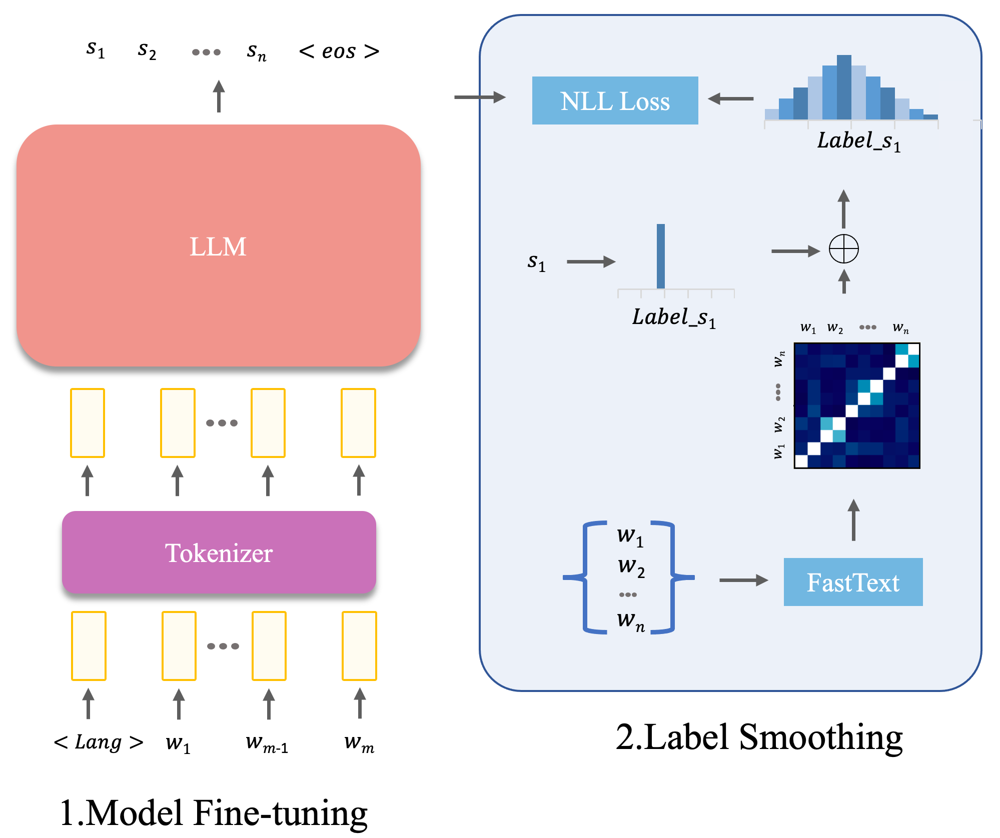

<div align="center">

# GLOSS2TEXT
## Sign Language Gloss translation using LLMs and Semantically Aware Label Smoothing

[](https://arxiv.org/abs/2407.01394)
[]()

</div>

## Description
Official PyTorch implementation of the paper:
<div align="center">

[GLOSS2TEXT: Sign Language Gloss translation using LLMs and Semantically Aware Label Smoothing](https://arxiv.org/abs/2407.01394).



</div>

### Bibtex
If you find this code useful in your research, please cite:

```
@inproceedings{fayyazsanavi-etal-2024-gloss2text,
    title = "{G}loss2{T}ext: Sign Language Gloss translation using {LLM}s and Semantically Aware Label Smoothing",
    author = "Fayyazsanavi, Pooya  and
      Anastasopoulos, Antonios  and
      Kosecka, Jana",
    editor = "Al-Onaizan, Yaser  and
      Bansal, Mohit  and
      Chen, Yun-Nung",
    booktitle = "Findings of the Association for Computational Linguistics: EMNLP 2024",
    month = nov,
    year = "2024",
    address = "Miami, Florida, USA",
    publisher = "Association for Computational Linguistics",
    url = "https://aclanthology.org/2024.findings-emnlp.947",
    pages = "16162--16171",
    abstract = "Sign language translation from video to spoken text presents unique challenges owing to the distinct grammar, expression nuances, and high variation of visual appearance across different speakers and contexts. Gloss annotations serve as an intermediary to guide the translation process. In our work, we focus on \textit{Gloss2Text} translation stage and propose several advances by leveraging pre-trained large language models (LLMs), data augmentation, and novel label-smoothing loss function exploiting gloss translation ambiguities improving significantly the performance of state-of-the-art approaches. Through extensive experiments and ablation studies on the PHOENIX Weather 2014T dataset, our approach surpasses state-of-the-art performance in \textit{Gloss2Text} translation, indicating its efficacy in addressing sign language translation and suggesting promising avenues for future research and development.",
}

```

## Installation :construction_worker: 
To set up the environment, run:

```
conda create -n slt python=3.8.4
```

## Dataset :closed_book: 
Please follow the link to download the [Phoenix-2014T dataset](
https://www-i6.informatik.rwth-aachen.de/~koller/RWTH-PHOENIX-2014-T/), the dataset is a german sign lanugae consisting the gloss and translation pairs:

Download the data and put it in the 'data' folder.

## Training :rocket:
To start training, run the following command. Modify any arguments as needed:

```
python train_gls2text_nllb_lora.py
```

## Test :bar_chart:
The pre-trained model is located [here](https://drive.google.com/drive/folders/1aoiBWg0-_iQ9JaWG4uscJuTMGJyvpnSL?usp=drive_link), download it and put it in the 'pretrained' folder, 

## License :books:
This code depends on several libraries, including PyTorch, HuggingFace, and Two-Stream Network. It also uses the Phoenix-2014T dataset. Please ensure compliance with their respective licenses.
